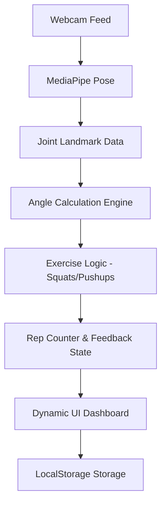

# MoveMentor: Virtual Gym Trainer - Development Guide

This guide outlines the step-by-step process to build a production-ready AI Gym Trainer using Computer Vision.

## 1. Project Planning & Architecture

### Modules
- **Pose Detection Engine**: Handles the webcam stream and landmarks extraction.
- **Exercise Logic Processor**: Calculates angles and counts repetitions.
- **Real-Time Feedback System**: Analyzes form and suggests corrections.
- **UI/UX Layer**: Displays the video feed, skeleton overlay, and workout stats.
- **Analytics Module**: Tracks workout history and calories.

### System Architecture


### Folder Structure
```
MoveMentor/
├── index.html          # Main application entry
├── style.css           # Premium styling
├── main.js            # App initialization
├── src/
│   ├── pose.js        # MediaPipe configuration
│   ├── logic/
│   │   ├── angles.js  # Math for joint angles
│   │   ├── exercises.js # Exercise state machines
│   │   └── feedback.js # Form correction rules
│   ├── ui/
│   │   ├── canvas.js  # Skeleton drawing
│   │   └── dashboard.js # Stats update logic
│   └── utils/
│       ├── timer.js   # Workout timer
│       └── storage.js # History management
├── assets/            # Icons and sounds
└── package.json       # Dependencies
```

---

## 2. Technology Selection

- **MediaPipe Pose**: High-performance, real-time pose estimation that works directly in the browser using WebAssembly. Chosen over OpenCV for lower latency and better cross-platform support.
- **Vite**: For fast development and optimized production builds.
- **Canvas API**: For drawing the skeleton overlay with minimal overhead.
- **Vanilla Javascript & CSS**: To ensure a lightweight application with a custom, premium aesthetic without the overhead of heavy frameworks.

---

## 3. Implementation Steps

We will build the application in phases:
1. **Initialize Core UI & Pose Detection**
2. **Implement Angle Calculation & Movement Detection**
3. **Build Exercise-Specific Logic (Bicep Curls, Squats, Pushups)**
4. **Create the Feedback & HUD (Heads-Up Display) System**
5. **Add Advanced Features (History, Timer, Sound)**

---

## 4. Engineering Best Practices
- **Throttle Calculations**: Don't run logic on every single frame if not needed (though 30fps is ideal for smoothness).
- **State Management**: Use a clean state machine for exercise phases (UP/DOWN/START).
- **Responsive Design**: Ensure the video feed scales based on screen size.
- **Accessibility**: Use high-contrast overlays for visibility during movement.
